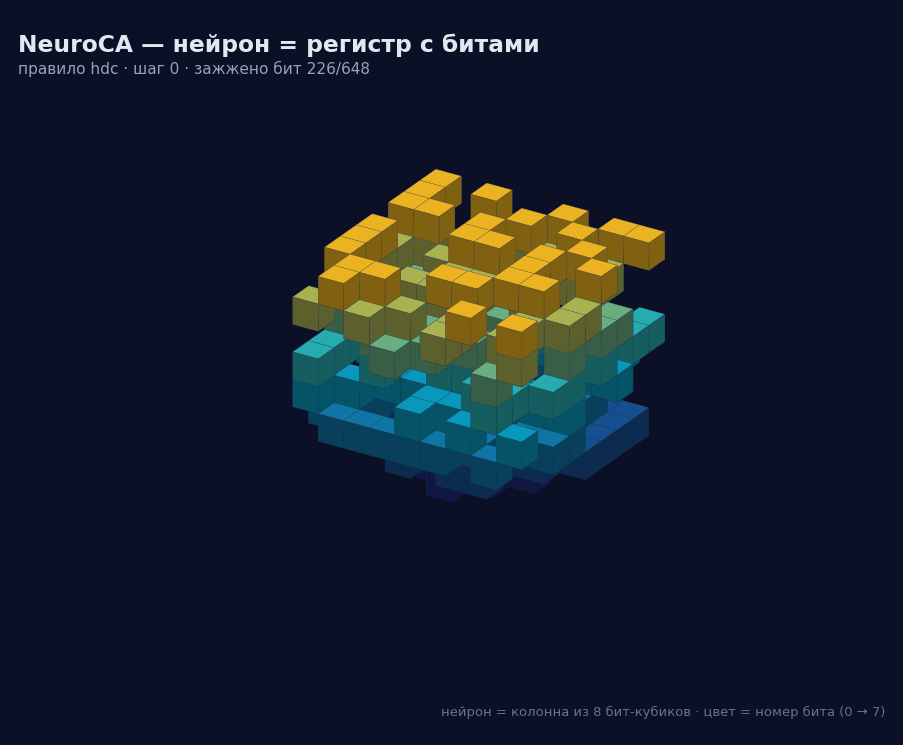
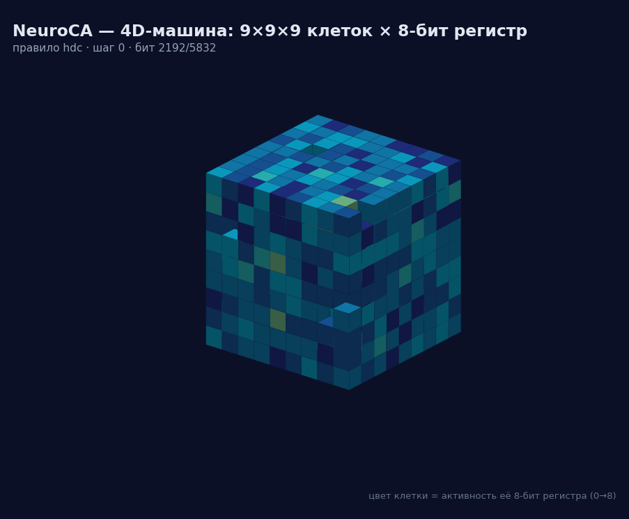
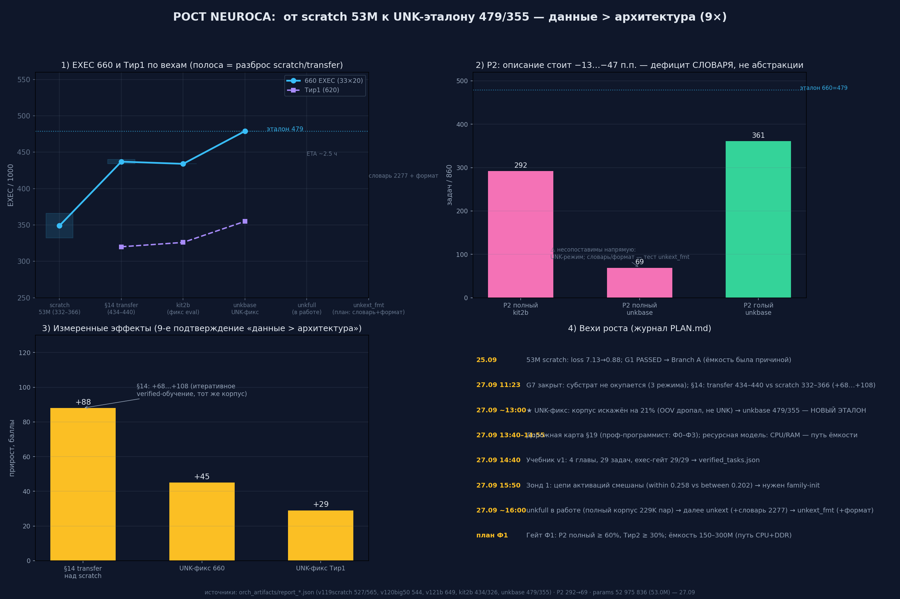
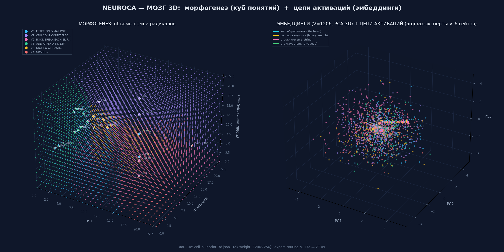
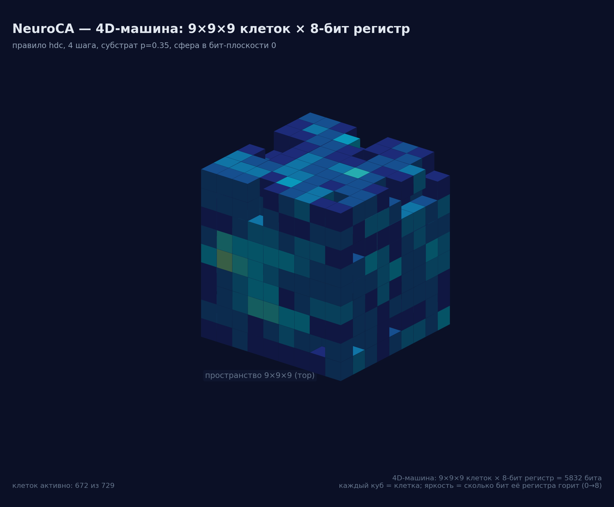
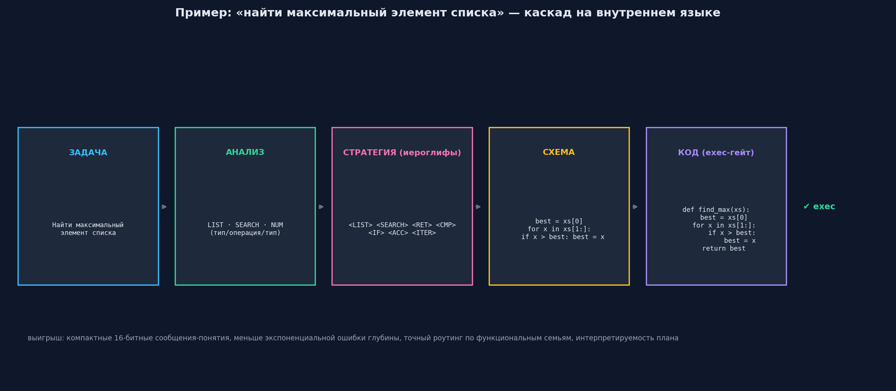

# NeuroCA — A Hybrid Neural Network Based on Cellular Automata

**Register-based cellular automaton substrate + Transformer/MoE for verifiable
Python code generation.**

[](LICENSE)
[](https://www.python.org/)
[](https://arxiv.org/)
[](https://github.com/Xartman86/neuroca)

- 🇷🇺 Русская версия: [README.ru.md](README.ru.md) · [Полная статья на русском](docs/NeuroCA_paper_ru.md)

## Demo

| Register machine (9×9×9×8 = 5832 bits) | Crystal dynamics (N+1 dims) |
|---|---|
|  |  |

## Visuals: growth curve & 3D structure

| Growth (660 EXEC · Tier1 · P2 · effects) | 3D view ("brain": semantic cube + PCA) | Isometric 4D crystal |
|---|---|---|
|  |  |  |

Growth curve data (27.09.2026): scratch 53M (332–366) → §14 transfer (434–440) →
`kit2b` 434/326 → **`unkbase` 479/660 · Tier1 355/620** (UNK fix restored 21% of the
corpus); P2 full-cue gap is a vocabulary/format deficit, not abstraction; measured
effects: §14 +68…+108, UNK-fix +45/+29. 3D view: semantic concept cube (24³) and
PCA-3D of token embeddings with per-task expert-activation chains.

NeuroCA is a research architecture in which a neuron is a **W-bit register on an
N-dimensional torus**, and the whole network is a binary cellular automaton (CA) in
N+1 dimensions. The deterministic CA dynamics provides ~530 features (the
`Substrate3` reservoir); a compact Transformer/MoE reads them and generates Python
code that is verified by **actual execution** (compile + real tests in a sandbox).

## How NeuroCA works

NeuroCA replaces matrix multiplications with **deterministic bit-level dynamics**
while keeping the ability to solve algorithmic tasks — on the closed corpus this
holds at 479/660 EXEC under the strict protocol (see Key results). Here is how
the machine is built, layer by layer.

### Big picture

```
                Python code (exec-verified)
                           ▲
        ┌──────────────────┴──────────────────┐
        │   HybridPrefix head (53M)            │  learns, generates code
        │   d=256 · L=6 · H=8 · MoE 8 (top-3)  │
        └──────────────────┬──────────────────┘
                           │  ~530 features (FDIM=530)
        ┌──────────────────┴──────────────────┐
        │   Substrate3: binary CA              │  frozen reservoir,
        │   9×9×9×8 = 5832 bits on the torus   │  no gradients
        └─────────────────────────────────────┘
```

### Neuron = register on a torus

The state of a neuron is a **W-bit register** placed on an **N-dimensional
torus**; the whole network is a binary cellular automaton in **N+1 dimensions**,
with the register axis playing the (N+1)-th dimension. The flagship machine is
9×9×9×8 = **5832 bits** and runs at ~130M bit-updates/s on CPU (no bit-packing
needed).

### The substrate: a frozen reservoir

The CA dynamics produces ~530 features (`Substrate3`) that are **never trained** —
a fixed, reproducible bit-level reservoir whose feature cache is precomputed once
per corpus:

| Class | What it tracks |
|---|---|
| Shift chains (12 tokens) | temporal patterns along register axes |
| Syntax detectors | structural markers of the input |
| Counters 8/16/32/64 | how many times a bit pattern repeats |
| Phase clocks | synchronization of bit planes |
| Conjunctions + RBN | combinatorial density / random Boolean dynamics |

This is reservoir computing in spirit: cheap, deterministic, rich representation.

### The head: HybridPrefix

`HybridPrefix` — d=256, L=6, H=8, MoE with 8 experts (top-3), FDIM=530, closed
vocabulary V=1078. It reads the substrate features and generates Python code.
Branch A is 53M parameters (from scratch); an early 7.2M variant is kept for
capacity comparisons.

### Cascade: task → analysis → strategy → scheme → code

Each task runs the chain `задача → анализ → стратегия → схема → код`. The inner
stages are written in the **internal hieroglyphic language** — compact radicals
like `<SORT> <LIST> <RET>` (see
[NeuroCA_internal_language.md](docs/NeuroCA_internal_language.md)): short formal
plans, verifiable at every step.



Example — «find the maximum of a list»: analysis `LIST·SEARCH·NUM` → strategy
`<LIST> <SEARCH> <RET> <CMP> <IF> <ACC> <ITER>` → scheme
`best = xs[0]; for x in xs[1:]: if x > best: best = x` → Python, checked by the
exec gate.

### Training: LLM teacher + exec verification

NeuroCA does not train on its own — a **large language model teacher** (Ollama
`qwen2.5:14b`, `qwen2.5-coder:14b`, `deepseek-coder`) helps. The loop is simple:

1. the teacher writes a solution for a task;
2. a harness **actually runs it** (compile + real tests in a sandbox);
3. only solutions that pass the check are distilled into the 53M student.

Why: the small model inherits the big model's skill, but not its mistakes — only
verified examples. Measured: of 208 teacher solutions, 106 passed (~51% yield).
Corpus: 33 algorithmic task families (sorting, binary search, GCD, digit sum,
brackets, base conversion, max-finding, …), 1089 base rows; the series also used
94K and 153K-pair corpora (current: 279,042 pairs).

### Verification instead of string matching

Many systems compare a model's answer with the ground truth **as text**. We do
not: NeuroCA's code counts as solved **only if it really runs and returns correct
answers on the tests**. Two extra safeguards keep the numbers honest:

- **Format guard:** every test must pass a format check. This is how a historical
  bug in the tests was caught — it inflated the metric (82.4% → the real 99.8% in
  the older, milder protocol);
- **A separate set of edge inputs (Tier1):** empty lists, negative numbers, tabs.
  Such examples are absent from the training corpus, so the model cannot memorize
  them — a fair test of generalization, not memory.

## Key results (series v0.1–v120, 36 registry versions)

| Metric | Value |
|---|---|
| 660 exec-run (33 tasks × 20), **etalon `v120big50_unkbase`** (promoted 27.09) | **479/660** (old 345 / new 134) |
| Tier1 (edge inputs, 620) | **355/620** |
| Prior etalon `kit2b` (same strict protocol) | 434/660 · Tier1 326 |
| Historical 660 on legacy bare-cue protocol (`kit2b`) | 658/660 = 99.7% — see protocol note below |
| Core throughput | ~130M bit-updates/s (CPU, no bit-packing) |
| Teacher loop (qwen2.5:14b) | 208 gens → 106 EXEC-valid (~51% yield); `second_max` 0→20/20 |

> **Protocol note (honesty):** the 99.7% figure was measured on the legacy
> bare-cue protocol (`"задача X"` only). In September 2026 the eval was
> strengthened to the **full-cue protocol** (`"задача X: <description>"`) — a
> construction that turned out to be **absent from the training corpus** (see
> P2-format defect below). Under the strict protocol the same model scores
> 434/660; the new etalon `unkbase` reaches 479/660.

## Latest findings (27.09.2026) — root defects found

Briefly, for a reader without context: below are three stories about **why the
numbers turned out to be harder than they looked**, and what follows from them.

1. **Corpus defect (root cause of weak Tier1).** While cleaning the text, a
   function silently dropped words that were not in the vocabulary (OOV). It
   turned out that **a fifth of the training text — 21%** (23,097 of 107,541
   words) never reached training. After the fix (`NEUROCA_TOK_UNK=1` keeps such
   words as UNK) the model improved noticeably: etalon `unkbase` — **660=479,
   Tier1=355** (+45/+29 vs the previous etalon). This is the main reason the
   model used to stumble on unusual inputs.
2. **P2-format defect: the model never saw the test format.** The benchmark tests
   tasks written as «задача X: <описание>», but **zero of 2,094 training cues**
   used that construction — the model physically could not learn it. Treatment
   (without touching the test tasks): 264 descriptions converted to the format,
   165 teacher paraphrases, a textbook (29 tasks), vocabulary extended to 2451
   words. Corpus grew to 279,042 pairs.
3. **G7 verdict (the "switch off the substrate" experiment).** At the current
   scale (53M), the cellular-automaton features give **no noticeable accuracy
   gain** (difference within noise). But a model trained **with** the substrate
   almost stops working **without** it (4 of 660) — the substrate is a working
   **support**, not a free lunch. An honest negative result: at larger scales the
   check is still ahead.

Measured lessons of the series: capacity solves profile "binarity" (7.2M→53M,
feature overlap 0.764→0.285); growth comes **from data, not parameters**
(544→648→658 on the legacy protocol); synthetic elisions/template steps in the
corpus **hurt**; edge data alone did not cure Tier1; the P2 deficit has a
**format/semantics nature**, not just a vocabulary one.

## Perspectives

Where the series is heading (measured, not promises):

1. **Compositional generalization** — assembling verified primitives into new
   solutions (currently 3/860): next step is composition data in the corpus.
2. **Staged cascade as the default generation mode** — it reached the best
   Tier1 result (358/620) without losing 660 quality (469/660).
3. **Scale** — whether the CA substrate starts paying off beyond 53M (on the
   current scale it is a support, not a free gain — G7).
4. **External benchmarks** — HumanEval (arXiv:2107.03374) is planned as an
   out-of-corpus check.
5. **Tier2/Tier3** — reuse of learned primitives, deeper edge-input coverage.

## Research

How the results are produced and kept honest:

- **Versioned registry** — 36 experiment versions, every metric tied to a
  checkpoint/corpus hash; etalon promoted on 27.09: `v120big50_unkbase`.
- **Strict protocol** — full-cue eval (`«задача X: <описание>»`); the legacy
  bare-cue figure (99.7%) is explicitly marked as historical.
- **Measured effects** — UNK fix +45/+29, §14 transfer +68…+108, capacity
  7.2M→53M (feature overlap 0.764→0.285).
- **Ablations** — G7 substrate ablation (support, not free lunch; cross-ablation
  4/660); format guard (caught an eval bug inflating 82.4%→99.8%).
- **Post-etalon measurements (29.09)** — staged cascade `weak_ep6`
  (660=469 · Tier1=358/620) and compositions P2·G13 (3/860, arity-match 96.2%).
- **Teacher loop** — 208 generations → 106 EXEC-valid (~51% yield).

## Theories

Theoretical bridges used in the project:

- **Cellular automata & reservoir computing** — deterministic bit dynamics as a
  frozen reservoir (spirit of ReLiCADA, Kauffman RBNs).
- **Neural cellular automata / morphogenesis** — Mordvintsev et al.
  (arXiv:2205.01681), Stovold (arXiv:2305.12971): the growth/self-organization
  line; our substrate is deliberately frozen, which poses the question of how to
  bring adaptation in without breaking determinism.
- **STaR self-improvement** (Zelikman et al., arXiv:2203.14465) — the teacher
  + exec-verification loop.
- **Internal hieroglyphic language** — short formal plans between cascade
  stages; theoretical bridges: Vygotsky's inner speech, Bakhtin, Kahneman's
  System 1/2, Friston's free energy, L-systems (details in
  [NeuroCA_internal_language.md](docs/NeuroCA_internal_language.md)).
- **Relevant Russian work** — neural CA for RL/self-organization and knowledge
  distillation for LLMs (Mokretsov/Tatarnikova line) — see paper §2.

## Repository structure

```
neuroca-repo/
├── README.md                 ← this file (English)
├── README.ru.md              ← Russian version
├── LICENSE                   ← CC BY 4.0
├── docs/
│   ├── NeuroCA_paper_ru.md       ← full paper, Russian (Markdown)
│   ├── NeuroCA_internal_language.md ← internal hieroglyphic language (RU, with figures)
│   ├── NeuroCA_paper_arXiv.md    ← full preprint (Markdown)
│   └── NeuroCA_paper_arXiv.pdf   ← preprint (11 pages, A4)
└── neuroca/                  ← core: RegisterCA engine, rules, hierarchy, ES
    ├── __init__.py
    ├── engine.py             ← RegisterCA: reset/set_bitplane/step/features
    ├── rules.py              ← local bit rules (majority, Toom, HDC, Life, Kauffman)
    ├── readout.py            ← readout layers
    ├── hierarchy.py / hierarchical.py ← hierarchical CA
    ├── es.py                 ← evolution strategy for rule LUTs
    ├── net.py / cluster.py   ← agent/cluster layers
    ├── arx.py                ← registers as hidden state
    ├── orchestrator.py       ← orchestration
    ├── tasks.py / tasks_code.py ← benchmark tasks (23/33 families)
    ├── collect_data.py       ← corpus collection helpers
    ├── viz.py                ← visualization (isometric bit rendering)
    └── hrun.py               ← run helpers
```

## Paper

- **arXiv:** pending (arXiv:XXXX.XXXXX — update after announcement)
- Full text: [`docs/NeuroCA_paper_arXiv.md`](docs/NeuroCA_paper_arXiv.md) and
  [`docs/NeuroCA_paper_arXiv.pdf`](docs/NeuroCA_paper_arXiv.pdf)
- 📰 News for newcomers (30.09): [`docs/ARTICLE_NEUROCA_3009.md`](docs/ARTICLE_NEUROCA_3009.md)
- Reproducibility details (environment, artifacts, commands, determinism): §8 of
  the paper.

## Quick start (core)

```bash
pip install numpy            # matplotlib needed only for viz.py
python -c "
import sys; sys.path.insert(0, '.')
from neuroca.engine import RegisterCA
m = RegisterCA(shape=(9,9,9), W=8)   # 5832-bit machine
m.reset('random')
m.step(16)
print(m.bitplane_densities())
"
```

The full training pipeline (feature cache, `train_branchA50.py`, exec harness
`eval_big50.py`, teacher loop) is part of the laboratory environment and is
available on request; the honest-metrics protocol is described in the paper
(§4.3 format guard, §6.4 Tier1 audit).

## License

This work is licensed under the **Creative Commons Attribution 4.0 International**
(CC BY 4.0). See [LICENSE](LICENSE) and https://creativecommons.org/licenses/by/4.0/.

## Citation (preprint)

```bibtex
@misc{neuroca2026,
  title  = {NeuroCA: A Hybrid Neural Network Based on Cellular Automata},
  author = {NeuroCA Laboratory},
  year   = {2026},
  note   = {Series v0.1--v120, 36 registry versions, etalon v120big50\_unkbase (479/660 EXEC, Tier1 355/620)}
}
```
