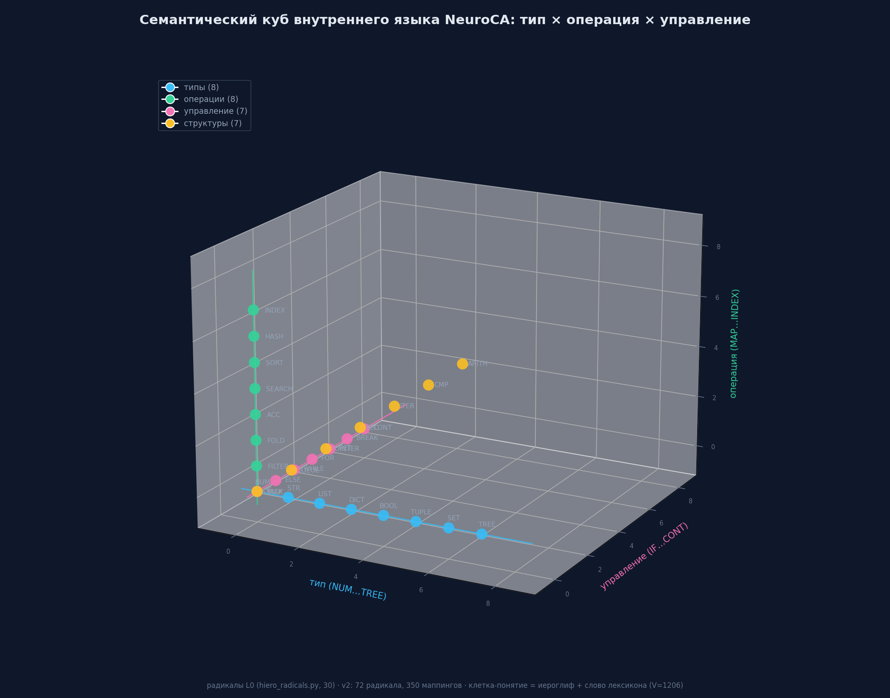
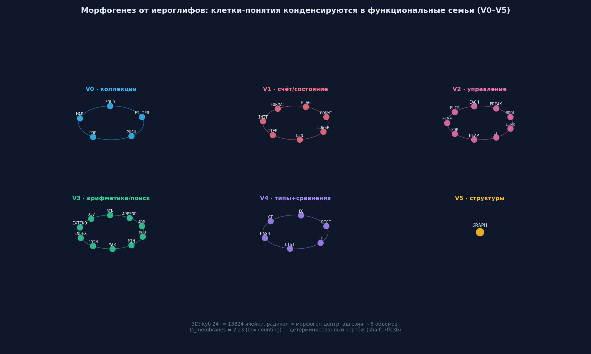

# Внутренний язык NeuroCA: иероглифы (радикалы)

**Дата:** 27.09.2026 · **Статус:** концепт + реализованные прототипы (hiero_radicals,
cell_architect3d) · **Связь:** раздел 8.1 статьи (иероглифический внутренний язык)

Внутренний язык NeuroCA — это компактный алфавит **иероглифов-радикалов**, на котором
промежуточные стадии каскада (анализ, стратегия, схема) пишутся вместо естественного
языка. Идея: внутренние рассуждения нейросети должны быть **короткими, формальными и
проверяемыми**, а не длинными текстами с накоплением ошибки.

---

## 1. Зачем нужен внутренний язык

| Проблема | Решение иероглифами |
|---|---|
| Длинные цепочки рассуждений → экспоненциальное накопление ошибки (P ~ p^L) | Сокращённые планы: 16-битные сообщения = понятия, цепочки короче |
| Роутинг по «похожести эмбеддингов» — ложный приор (зонд: NMI = 0.015, путь закрыт) | Роутинг по **функциональным семьям** = радикалам (реальная ось обученного роутера) |
| Неинтерпретируемые внутренние стадии | Иероглиф-план читается человеком: `<SORT> <LIST> <RET>` — видно, что делает модель |
| Словарь хрупок к OOV (UNK-цикл) | Радикалы — стабильное ядро языка, не зависящее от перестройки V |

Свойства внутренней речи по Выготскому — **сокращённость, предикативность,
семантичность** — реализуются иероглифами буквально; полифония (Бахтин) — агентами,
обменивающимися иероглиф-сообщениями.

---

## 2. Алфавит: 30 радикалов L0 (v116), 72 в v2

| Категория | Радикалы |
|---|---|
| **Типы (8)** | `NUM` `STR` `LIST` `DICT` `BOOL` `TUPLE` `SET` `TREE` |
| **Управление (7)** | `IF` `ELSE` `WHILE` `FOR` `RET` `BREAK` `CONT` |
| **Операции (8)** | `MAP` `FILTER` `FOLD` `ACC` `SEARCH` `SORT` `HASH` `INDEX` |
| **Структуры (7)** | `STACK` `QUEUE` `POINTER` `REC` `ITER` `CMP` `ARITH` |

v2 расширяет алфавит до **72 радикалов и 350 маппингов** русских слов → радикалов
(`RU_TO_RADICAL` в `hiero_radicals.py`): `сортировать→SORT`, `найти/поиск→SEARCH`,
`сумма/накопить→ACC`, `условие→IF`, `результат→RET` и т.д.

**Правило:** естественный русский остаётся в описании задачи и анализе; **стратегия и
схема** заменяются радикалами (формат корпуса: `задача/анализ/стратегия(иероглифы)/схема/код/тесты`).

---

## 3. Позиционная грамматика

Фраза внутреннего языка — последовательность радикалов с фиксированными позициями:

```
[ДЕЙСТВИЕ] [ОБЪЕКТ] [ОТНОШЕНИЕ]
```

Парсер `hiero_validate.py` проверяет валидность фраз (T0-ярус контроля — структурный
баланс плана, бесплатно, счётчиками субстрата). **Значение иероглифа = эффект на
состояние регистров** (операционная семантика), а не произвольный символ.

### Примеры фраз

| Естественный язык | Иероглиф-фраза |
|---|---|
| «отсортировать список» | `<SORT> <LIST> <RET>` |
| «найти максимум в списке» | `<SEARCH> <LIST> <CMP>` |
| «вернуть второй элемент» | `<INDEX> <LIST> <RET>` |
| «сумма элементов» | `<ACC> <ITER> <NUM>` |
| «если больше — вернуть» | `<IF> <CMP> <RET>` |
| «бинарный поиск по отсортированному» | `<SEARCH> <BIN> <SORT>` |

---

## 4. Пример полного каскада


Задача **«найти максимальный элемент списка»** проходит стадии:

1. **Задача** (естественный язык) — вход.
2. **Анализ** — тип/операция/тип: `LIST · SEARCH · NUM`.
3. **Стратегия (иероглифы)** — `<LIST> <SEARCH> <RET> <CMP> <IF> <ACC> <ITER>`.
4. **Схема** — `best = xs[0]; for x in xs[1:]: if x > best: best = x`.
5. **Код** — Python, проверяется **exec-гейтом** (компиляция + реальные тесты).

Выигрыш каскада: короткий формальный план на каждом шаге → точный роутинг по семьям
и меньше шанса «рассуждать в неверную сторону»; каждый шаг верифицируем.

---

## 5. Семантический куб (3D-структура языка)



Радикалы размещаются по **категориальным осям**: тип (NUM…TREE) × операция
(MAP…INDEX) × управление (IF…CONT). Прототип `cell_architect3d.py` строит куб
**24³ = 13 824 ячейки**; каждый радикал — **морфоген-центр**: клетка читает градиенты
и дифференцируется по ближайшему источнику (позиционная информация), адгезия
объединяет территории в объёмы.

### Морфогенез даёт функциональные семьи (V0–V5)



| Объём | Радикалы (что собралось вместе) | Смысл |
|---|---|---|
| V0 | FILTER FOLD MAP POP PUSH | операции над коллекциями |
| V1 | COUNT FLAG FORMAT INIT ITER LEN LOWER… | счёт/состояние/строки |
| V2 | BOOL BREAK EACH ELIF ELSE FOR HEAP IF LINK… | управление/условия |
| V3 | ADD APPEND BIN DIV EXTEND INDEX JOIN MAX MIN MOD… | арифметика/поиск/списки |
| V4 | DICT EQ GT HASH LIST LT | типы и сравнения |
| V5 | GRAPH | структуры |

**D_membranes = 2.23** (box-counting по границам объёмов) — фрактальная метрика роста
в 3D (полоса 2..3). Чертёж детерминирован (повторный прогон — идентичен, sha fd7ffc3b).

Ключевой факт: собранные морфогенезом семьи **совпадают с осью обученного роутера**
(expert_routing_v117e — функциональные семьи; эмбеддинг-гомофилия закрыта зондом
NMI=0.015). Конструктор с иероглифами строит структуру **по той оси, которая реально
работает**.

---

## 6. Иероглифы в системе (роли)

| Место | Роль иероглифов |
|---|---|
| **Каскад** | стратегия/схема на радикалах → проверяемый план |
| **Роутер/MoE** | маршрут гейта — функциональные семьи (семейно-организованная инициализация, family-init — кандидат, **не измерен**: тест random vs family-init, 300–500 шагов kit2b) |
| **Наблюдатель** | T0 — структурный баланс плана (бесплатно); T1 — семантика трассы (дрейф роутера); T2 — выборочный exec; T3 — долгосрочный мониторинг |
| **Рибосома (ДНК-инженер)** | иероглифы = «нуклеотиды» (алфавит 72); verified-примитив = иероглиф-сигнатура (`<SORT> <BIN>`) + exec-проверенная реализация + тесты |
| **Куррикулум** | порядок обучения по семьям радикалов (типы → операции → управление → композиции) |
| **Композиции Тир2** | последовательность радикалов: `<SORT> <BIN>` = «отсортировать + бинарный поиск» → сборка проверенных модулей |
| **UNK-цикл** | радикалы — стабильное ядро, устойчивое к перестройке словаря |

---

## 7. Измеренный статус (честно)

- ✅ Реализовано: `hiero_radicals.py` (30/72 радикала, RU_TO_RADICAL), `convert_strategy`,
  `hiero_validate.py` (парсер фраз), 3D-прототип `cell_architect3d.py` (куб 24³, D=2.23).
- ✅ Измерено: роутер обученной модели организован **по функциональным семьям**, а не по
  эмбеддинг-близости (зонд 27.09: NMI(эксперт, эмбеддинг-кластеры) = 0.015, z=4.5).
- ⚠️ **Не измерено:** family-init (инициализация роутера по радикальным семьям) —
  честный кандидат холодного старта; сравнение random vs family-init (300–500 шагов
  kit2b, дельта loss/660) — следующий тест.
- ⚠️ Ограничение: внутренний язык — **организационная ось**, а не новый обучаемый
  объект; G7 показал, что веса-инициализация субстратом не окупается — иероглифы
  наследуют тот же урок: ценность в организации/куррикулуме, пока не измерен выигрыш
  family-init.

---

## 8. Литература (связи)

- Выготский — интериоризация: запрос → иероглиф-план (внутренняя речь).
- Бахтин — полифония: агенты + self-consistency.
- Канеман — двойной процесс: субстрат (Система 1) + оркестраторы (Система 2).
- Фристон — предиктивный цикл: план против exec-ошибки.
- L-системы — «живой текст»: аксиома → итерации роста → исполнимый код (раздел 8.3 статьи).

*Код: `hiero_radicals.py`, `cell_architect3d.py`, `cell_blueprint_3d.json` в репозитории
проекта. Иллюстрации: `assets/internal_lang_{cube,plan,families}.png`.*
